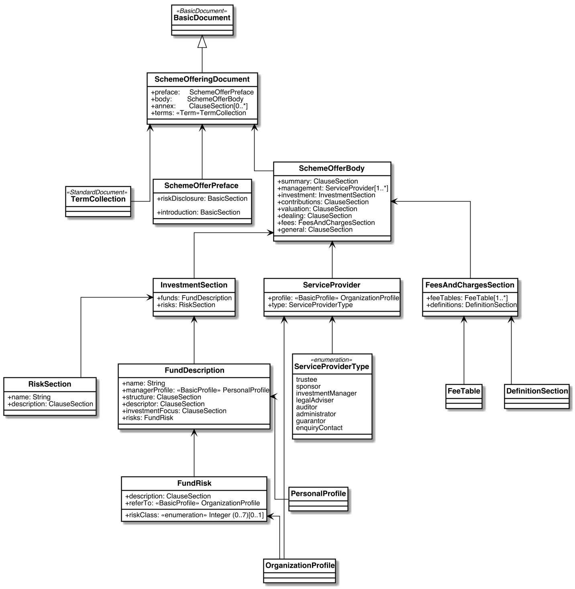
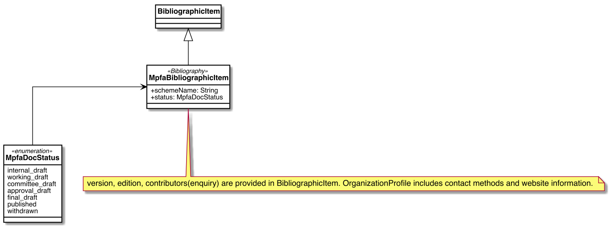
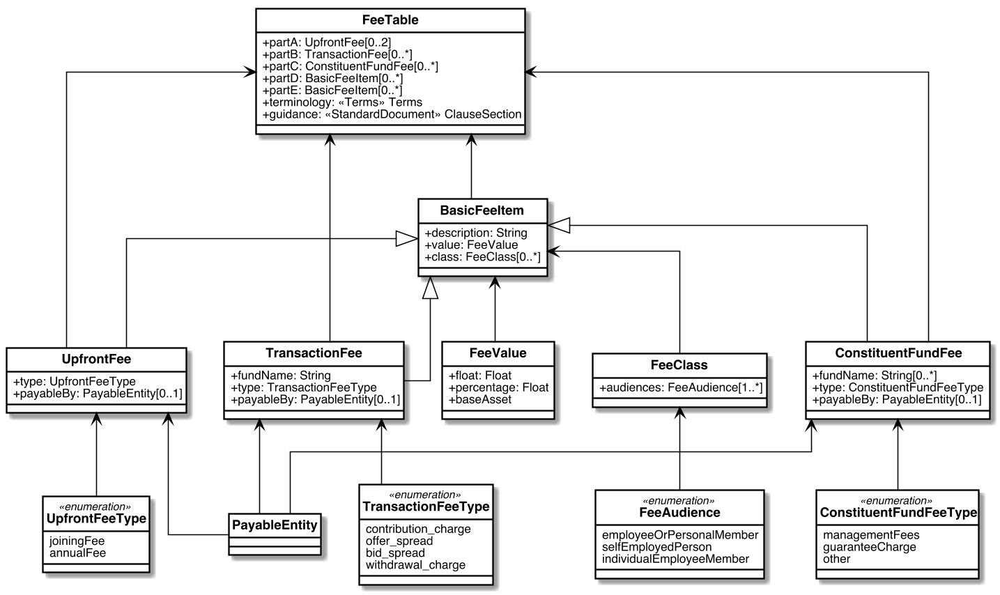
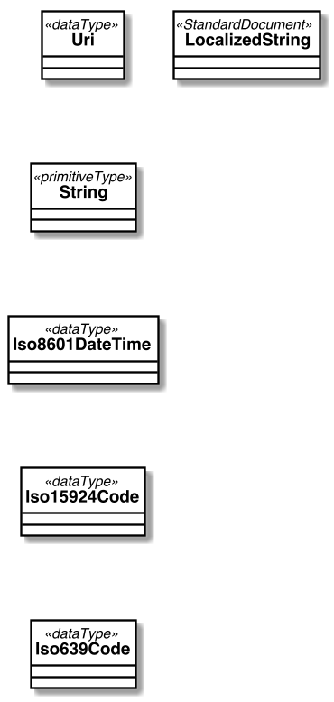

= Metanorma MPFA Models

This is where we keep the Metanorma MPFA model definitions.

The MPFA Standard Document format is an instance of the
https://github.com/riboseinc/metanorma-model-standoc[Metanorma StandardDocument model].
Details of the general model can be found on its page.

== Scope

This document provides the MPFA reference data models for:

* standard documents; and
* offering documents.

Implementation of the reference model and serialization formats are
out of scope of this document.
The mapping of the reference model to output formats such as HTML,
and the application of organization-specific styling to those
outputs, is out of scope of this document.

== MPFA Standard Document

== MPFA Offering Document

=== OfferingDoc Document Model

=== OfferingDoc Bibliographic Item Model

=== OfferingDoc Fee Table

=== OfferingDoc Data Types

== Notes
